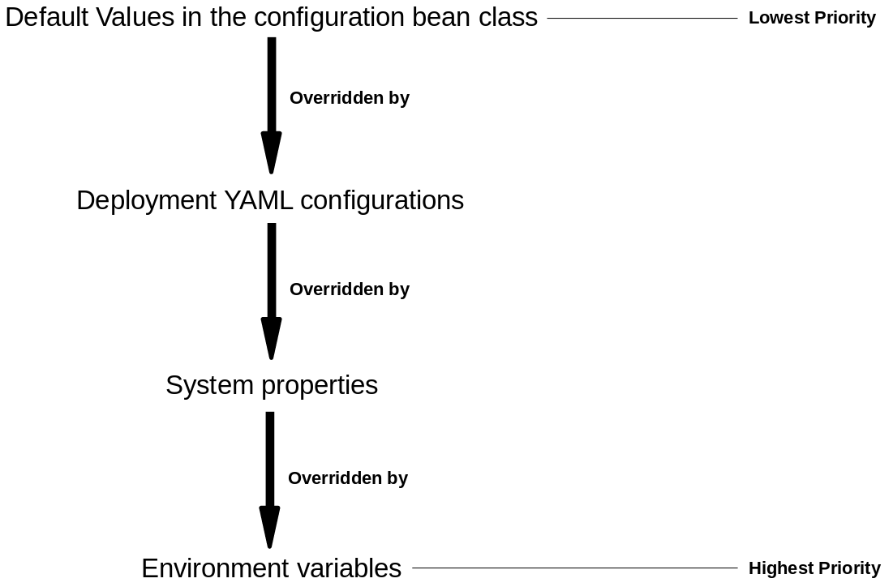
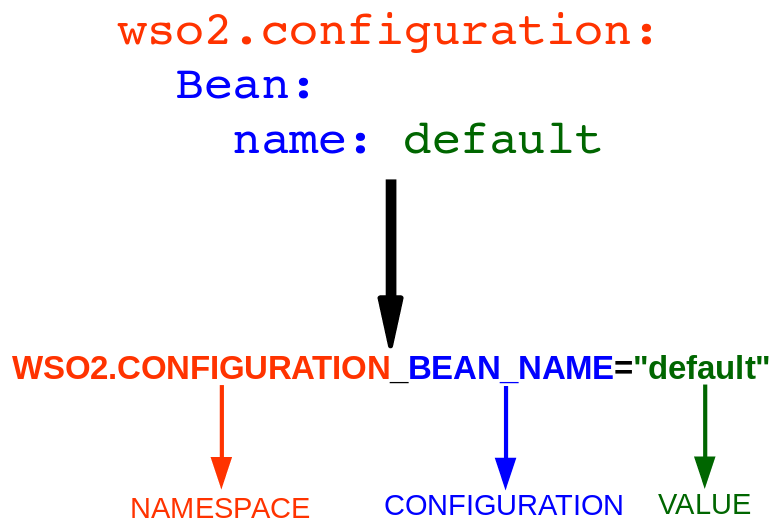

# Configurations via environment variables / system properties

In a containerized environments, maintaining multiple configurations for each and every container is not reliable. This is due to,

* Maintaining multiple configurations for multiple containers is a cumbersome task.
* Most of the configurations could be duplicated among configuration files.
* Even if a single configuration file is to be maintained, the physical file needs to be edited in order to suit the required configuration for a specific container, thus would violate the immutable nature of containerization.

In order to overcome the above, configurations can be provided via environment variables or system properties following a specific pattern.

## Priority order when building the configuration



System properties / environment variables could be used to override deployment.yaml configurations or add new configurations. This is mostly useful in containerized environments to overcome the above mentioned limitations.

## Environment variable / system property pattern

`<NAMESPACE>_<CONFIGURATION>="<VALUE>"`



#### Example 1:

Consider the below YAML configuration.

```yaml
wso2.configuration:
  complexBean:
    name: default
    Bean:
      name: default
```

The above configuration can be represented with the below environment variables / system properties:

```bash
WSO2_CONFIGURATION__COMPLEXTESTBEAN_NAME="default"
WSO2_CONFIGURATION__COMPLEXTESTBEAN_BEAN_NAME="default"
```

Where,

* NAMESPACE = `wso2.configuration`

___
**Notes:** 

* As a convention (refer [environment variable / system property pattern](#user-content-environment-variable--system-property-pattern)),
  * The environment variable names / system property names should be in all caps.
  * The environment variable / system property segments should be separated by an underscore ("_").
___

#### Example 2:

Consider the below YAML configuration.

```yaml
testconfiguration:
  tenant: tenant
  transports:
    transport:
      -  name: abc
         port: 8000
         secure: false
         desc: This transport will use 8000 as its port
         password: password
      -  name: pqr
         port: 8001
         secure: true
         desc: This transport will use 8001 as its port. Secure - true
      -  name: xyz
         port: 9000
         secure: true
         desc: This transport will use 9000 as its port
```

The above configuration can be represented with the below environment variables / system properties:

```bash
TESTCONFIGURATION_TENANT="tenant"

# Transport "abc"
TESTCONFIGURATION_TRANSPORTS_TRANSPORT_0_NAME="abc"
TESTCONFIGURATION_TRANSPORTS_TRANSPORT_0_PORT="8000"
TESTCONFIGURATION_TRANSPORTS_TRANSPORT_0_SECURE="false"
TESTCONFIGURATION_TRANSPORTS_TRANSPORT_0_DESC="This transport will use 8000 as its port"
TESTCONFIGURATION_TRANSPORTS_TRANSPORT_0_PASSWORD="password"

# Transport "pqr"
TESTCONFIGURATION_TRANSPORTS_TRANSPORT_1_NAME="pqr"
TESTCONFIGURATION_TRANSPORTS_TRANSPORT_1_PORT="8001"
TESTCONFIGURATION_TRANSPORTS_TRANSPORT_1_SECURE="true"
TESTCONFIGURATION_TRANSPORTS_TRANSPORT_1_DESC="This transport will use 8001 as its port. Secure - true"

# Transport "xyz"
TESTCONFIGURATION_TRANSPORTS_TRANSPORT_2_NAME="xyz"
TESTCONFIGURATION_TRANSPORTS_TRANSPORT_2_PORT="9000"
TESTCONFIGURATION_TRANSPORTS_TRANSPORT_2_SECURE="true"
TESTCONFIGURATION_TRANSPORTS_TRANSPORT_2_DESC="This transport will use 9000 as its port"
```

Where,

* NAMESPACE = `testconfiguration`

___
**Notes:** 

* As a convention (refer [environment variable / system property pattern](#user-content-environment-variable--system-property-pattern)), 
  * The environment variable names / system property names should be in all caps.
  * The environment variable / system property segments should be separated by an underscore ("_").
* Array elements are identified with the separation of a positive integer.
* **Each array element should be able to be identified via a unique property in the array element.** 
**In this example, we can identify "NAME" as a unique property (each transport can be identified with it's name).**
This unique property is used internally to identify each transport in the overriding process. 
___

## Specifying the unique identifiable property for configuration arrays

By default, the unique identifiable attribute is either "ID" or "NAME" ("ID" has the highest priority). If both
these attributes are not present, you can specify the unique identifiable attribute via an environment 
variable (Refer [Example 3](#user-content-example-3---specifying-unique-identifiable-property-via-an-environment-variable--system-properties))

#### Example 1:

Consider the below YAML configuration.

```yaml
testconfiguration:
  tenant: tenant
  transports:
    transport:
      -  name: abc
         port: 8000
         secure: false
         desc: This transport will use 8000 as its port
         password: password
      -  name: pqr
         port: 8001
         secure: true
         desc: This transport will use 8001 as its port. Secure - true
      -  name: xyz
         port: 9000
         secure: true
         desc: This transport will use 9000 as its port
```
The above configuration can be represented with the below environment variables / system properties:

```bash
TESTCONFIGURATION_TENANT="tenant"

# Transport "abc"
TESTCONFIGURATION_TRANSPORTS_TRANSPORT_0_NAME="abc"
TESTCONFIGURATION_TRANSPORTS_TRANSPORT_0_PORT="8000"
TESTCONFIGURATION_TRANSPORTS_TRANSPORT_0_SECURE="false"
TESTCONFIGURATION_TRANSPORTS_TRANSPORT_0_DESC="This transport will use 8000 as its port"
TESTCONFIGURATION_TRANSPORTS_TRANSPORT_0_PASSWORD="password"

# Transport "pqr"
TESTCONFIGURATION_TRANSPORTS_TRANSPORT_1_NAME="pqr"
TESTCONFIGURATION_TRANSPORTS_TRANSPORT_1_PORT="8001"
TESTCONFIGURATION_TRANSPORTS_TRANSPORT_1_SECURE="true"
TESTCONFIGURATION_TRANSPORTS_TRANSPORT_1_DESC="This transport will use 8001 as its port. Secure - true"

# Transport "xyz"
TESTCONFIGURATION_TRANSPORTS_TRANSPORT_2_NAME="xyz"
TESTCONFIGURATION_TRANSPORTS_TRANSPORT_2_PORT="9000"
TESTCONFIGURATION_TRANSPORTS_TRANSPORT_2_SECURE="true"
TESTCONFIGURATION_TRANSPORTS_TRANSPORT_2_DESC="This transport will use 9000 as its port"
```

Where,

* NAMESPACE = `testconfiguration`
* Each transport is identified uniquely with the "NAME" attribute (ex: TESTCONFIGURATION_TRANSPORTS_TRANSPORT_0_NAME).

#### Example 2:

Consider the below YAML configuration.

```yaml
testconfiguration:
  tenant: tenant
  transports:
    transport:
      -  name: abc
         id: 001
         port: 8000
         secure: false
         desc: This transport will use 8000 as its port
         password: password
      -  name: pqr
         id: 002
         port: 8001
         secure: true
         desc: This transport will use 8001 as its port. Secure - true
      -  name: xyz
         id: 003
         port: 9000
         secure: true
         desc: This transport will use 9000 as its port
```
The above configuration can be represented with the below environment variables / system properties:

```bash
TESTCONFIGURATION_TENANT="tenant"

# Transport "abc"
TESTCONFIGURATION_TRANSPORTS_TRANSPORT_0_NAME="abc"
TESTCONFIGURATION_TRANSPORTS_TRANSPORT_0_ID="001"
TESTCONFIGURATION_TRANSPORTS_TRANSPORT_0_PORT="8000"
TESTCONFIGURATION_TRANSPORTS_TRANSPORT_0_SECURE="false"
TESTCONFIGURATION_TRANSPORTS_TRANSPORT_0_DESC="This transport will use 8000 as its port"
TESTCONFIGURATION_TRANSPORTS_TRANSPORT_0_PASSWORD="password"

# Transport "pqr"
TESTCONFIGURATION_TRANSPORTS_TRANSPORT_1_NAME="pqr"
TESTCONFIGURATION_TRANSPORTS_TRANSPORT_1_ID="002"
TESTCONFIGURATION_TRANSPORTS_TRANSPORT_1_PORT="8001"
TESTCONFIGURATION_TRANSPORTS_TRANSPORT_1_SECURE="true"
TESTCONFIGURATION_TRANSPORTS_TRANSPORT_1_DESC="This transport will use 8001 as its port. Secure - true"

# Transport "xyz"
TESTCONFIGURATION_TRANSPORTS_TRANSPORT_2_NAME="xyz"
TESTCONFIGURATION_TRANSPORTS_TRANSPORT_2_ID="003"
TESTCONFIGURATION_TRANSPORTS_TRANSPORT_2_PORT="9000"
TESTCONFIGURATION_TRANSPORTS_TRANSPORT_2_SECURE="true"
TESTCONFIGURATION_TRANSPORTS_TRANSPORT_2_DESC="This transport will use 9000 as its port"
```

Where,

* NAMESPACE = `testconfiguration`
* Each transport is identified uniquely with the "ID" attribute (ex: TESTCONFIGURATION_TRANSPORTS_TRANSPORT_0_ID). **Even though "NAME" is also a candidate for the unique identifiable attribute, "ID" is chosen over "NAME" since "ID" has a higher priority.**

#### Example 3 - specifying unique identifiable property via an environment variable / system properties:

Consider the below YAML configuration.

```yaml
testconfiguration:
  tenant: tenant
  transports:
    transport:
      -  port: 8000
         uniqueKey: abc
         secure: false
         desc: This transport will use 8000 as its port
         password: password
      -  port: 8001
         uniqueKey: pqr
         secure: true
         desc: This transport will use 8001 as its port. Secure - true
      -  port: 9000
         uniqueKey: xyz
         secure: true
         desc: This transport will use 9000 as its port
```
The above configuration can be represented with the below environment variables / system properties:

```bash
TESTCONFIGURATION_TENANT="tenant"

# Transport "abc"
TESTCONFIGURATION_TRANSPORTS_TRANSPORT_0_UNIQUEKEY="abc"
TESTCONFIGURATION_TRANSPORTS_TRANSPORT_0_PORT="8000"
TESTCONFIGURATION_TRANSPORTS_TRANSPORT_0_SECURE="false"
TESTCONFIGURATION_TRANSPORTS_TRANSPORT_0_DESC="This transport will use 8000 as its port"
TESTCONFIGURATION_TRANSPORTS_TRANSPORT_0_PASSWORD="password"

# Transport "pqr"
TESTCONFIGURATION_TRANSPORTS_TRANSPORT_1_UNIQUEKEY="pqr"
TESTCONFIGURATION_TRANSPORTS_TRANSPORT_1_PORT="8001"
TESTCONFIGURATION_TRANSPORTS_TRANSPORT_1_SECURE="true"
TESTCONFIGURATION_TRANSPORTS_TRANSPORT_1_DESC="This transport will use 8001 as its port. Secure - true"

# Transport "xyz"
TESTCONFIGURATION_TRANSPORTS_TRANSPORT_2_UNIQUEKEY="xyz"
TESTCONFIGURATION_TRANSPORTS_TRANSPORT_2_PORT="9000"
TESTCONFIGURATION_TRANSPORTS_TRANSPORT_2_SECURE="true"
TESTCONFIGURATION_TRANSPORTS_TRANSPORT_2_DESC="This transport will use 9000 as its port"
```

However, since "ID" and "NAME" attributes are not present, you have to specify your unique identifiable attribute name
via an environment variable / system property. This variable name is suffixed with the "UNIQUE" keyword.

```bash
TESTCONFIGURATION_TRANSPORTS_TRANSPORT_UNIQUE="UNIQUEKEY"
```

Where,

* NAMESPACE = `testconfiguration`
* Each transport is identified uniquely with the "UNIQUEKEY" attribute since it is specified via an environment variable / system property.
